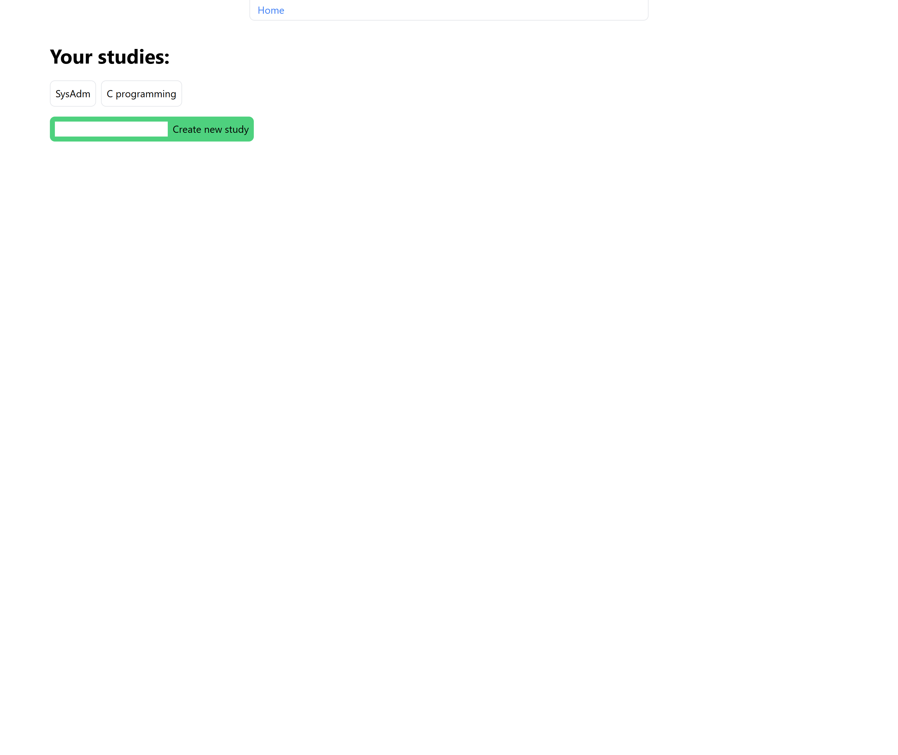
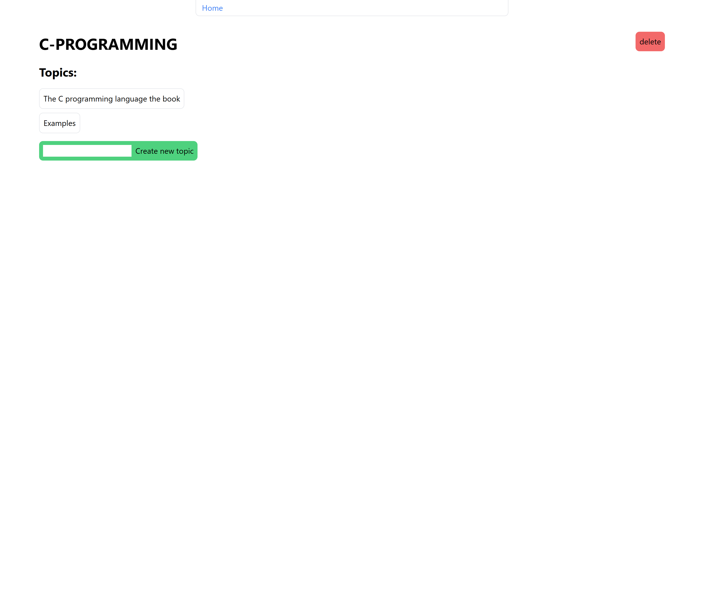
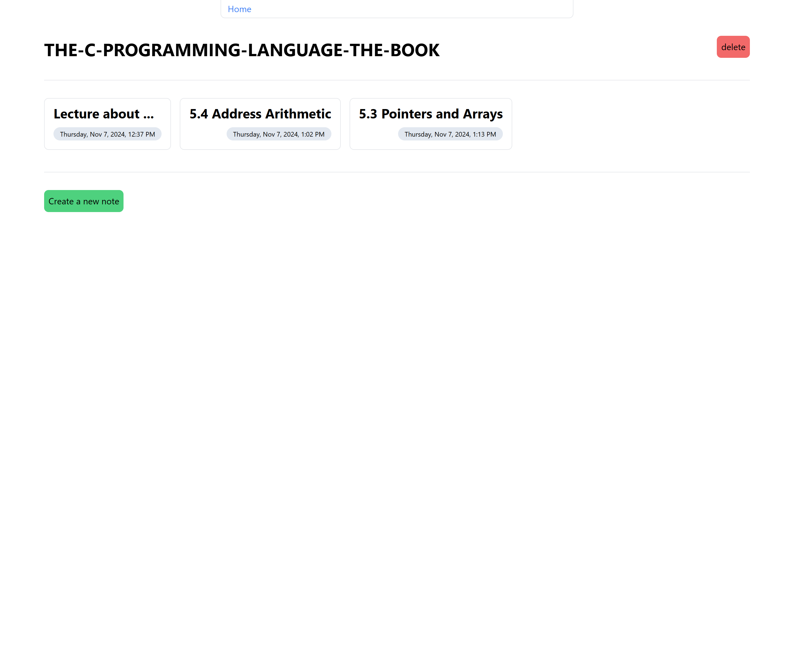

## studyhub

I wanted something to collect all of my notes at one place and where I can pass
the note directly to any AI provider to give me a summary (or a quiz) of what
I wrote to simplify learning, as all of my notes are usually scattered across my
desktop and other folders.

You can create a study, which contains multiple topics, and the topics can contain
multiple notes. The note editor uses the QuillEditor package, so you can either
type a note directly or paste something in.

