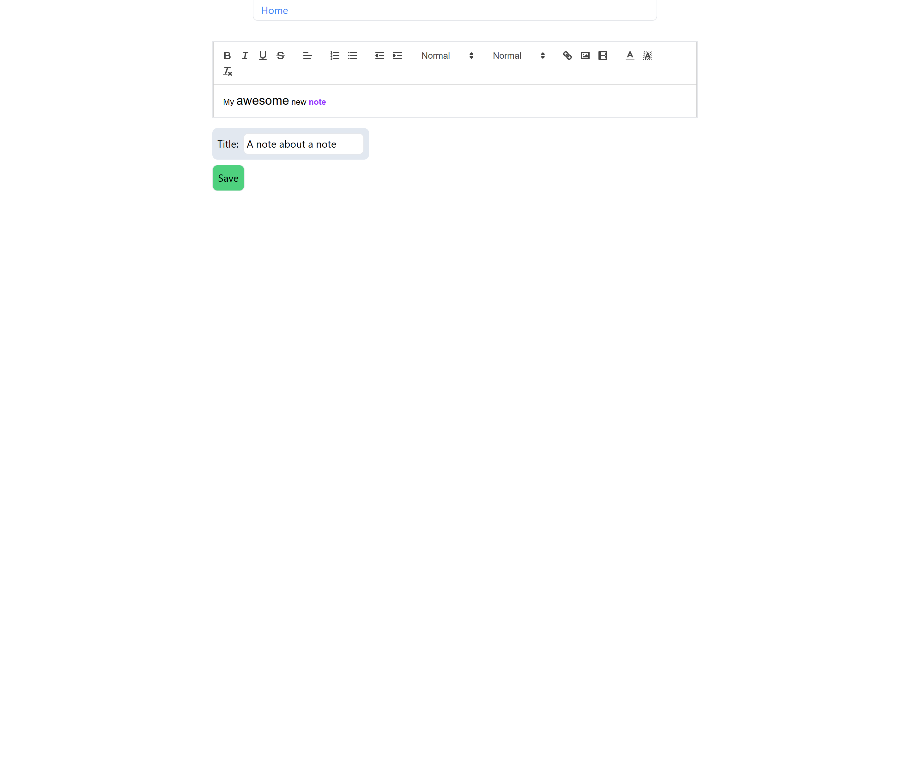

## studyhub

I wanted something to collect all of my notes at one place, as my notes are usually
scattered across my desktop and other folders. Additionally, I thought it would be cool, if I could
just pass my note and it's content directly to any AI provider just by clicking a button.

I am using the google gemini api with the free gemini flash model to give me a summary
(or a quiz or whatever you want) to get the key information within just a snap.

<video src="assets/demo.mp4" controls muted playsinline ></video>


The Editor is the QuillEditor, so you can either
type a note directly or paste something in.



### Get started

Prereq:

Node installed 
+
a MongoDB cluster (its free) and
a gemini api key (also free).

Clone or download the repo,

Run:
```bash
npm install --force
```

Create a .env.local file in the root and 
add your MongoDB URI and the gemini api key.

Run:
```bash
npm run dev
```
or
```bash
npm run build && npm start
```
